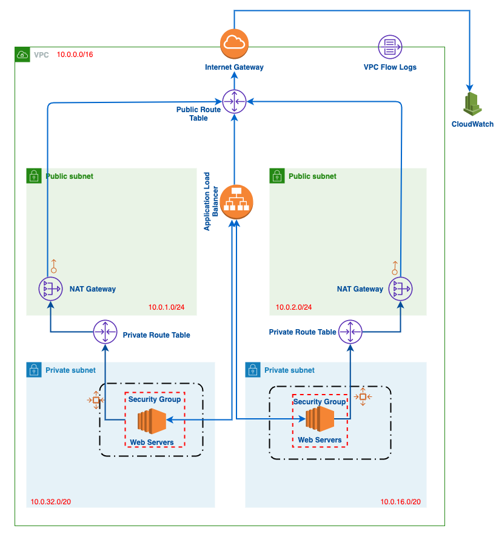

# CLOUD FORMATION TEMPLATE - INFRA STRUCTURE AS CODE

The project has CloudFormation templates that creates nested stacks for creating :

    1. A VPC with 2 Public and 2 Private Subnets.
      1.1. Will create a NAT gateway in both public subnets for QA and Production environment for HA.
      1.2. For Development environment, only one NAT Gateway will be created to keep the cost down.
      1.3. Private Subnets has route to NAT Gateways internet connectivity.
    2. An Application Load Balancer
      2.1. Will have a default target group.
      2.1. Will have a security group allowing HTTP and HTTPS connection from internet.
    3. A website application with EC2 autoscaling
      3.1. An AutoScaling Group with  a LaunchTemplate.
      3.2. A WebServer target gorup that registers with ALB Listener over HTTP.
      3.3. A scaling policy based on the CPU Usage.'

## Architecture

 

## Running Using UI

First Upload all the ``yaml`` files into a S3 bucket. Update the S3 references to the Infra and application yaml in the master.yml file.

You can go to CloudFormation and create stack. Choose the uploaded S3 ``maser.yaml`` and create the stack. 
